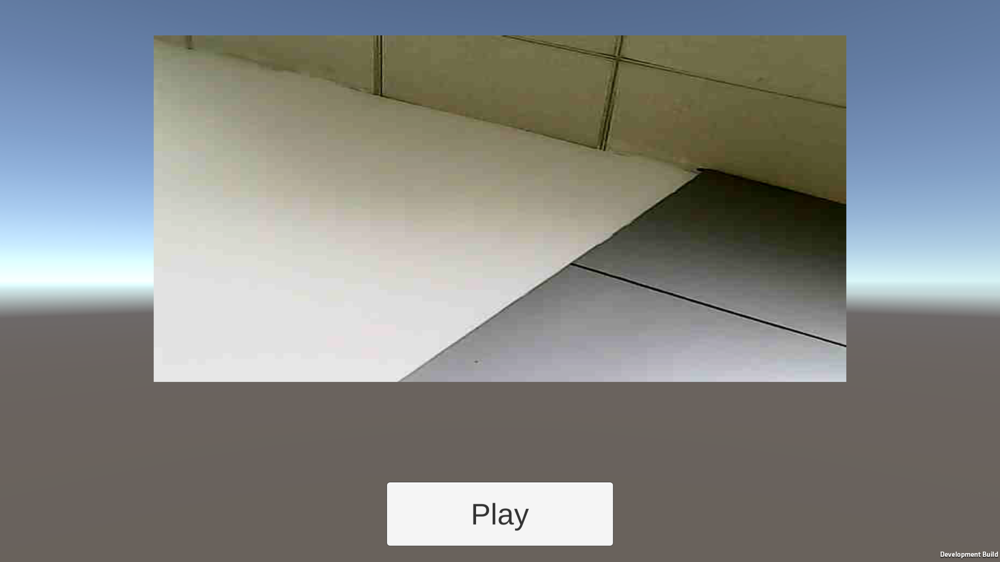

# 编写Android播放视频插件.md

妈的居然搞了一个星期。

主要难点在于，Android里面，用来播放视频的Texture是`GL_TEXTURE_EXTERNAL_OES`格式的。Unity用的Texture`是GL_TEXTURE_2D`格式的。中间需要转换才可以在Unity里面显示，这里需要用到的是Render To Texture，就是Frame Buffer Object啦。

要显示`GL_TEXTURE_EXTERNAL_OES`，需要特别的shader

VertexShader

```
attribute vec4 aPosition;
attribute mediump vec2 aTextureCoord;
varying mediump vec2 vTextureCoord;
uniform mat4 uMVPMatrix;

void main() {
  gl_Position = uMVPMatrix * aPosition;
  vTextureCoord = aTextureCoord.xy;
}
```

FragmentShader

```
#extension GL_OES_EGL_image_external : require

precision mediump float;

varying vec2 vTextureCoord;
uniform samplerExternalOES sTexture;

void main() {
  gl_FragColor = texture2D(sTexture, vTextureCoord);
}
```

## 新建一个FBO对象：

```java
public class FBO {
    private Texture2D mTexture2D;
    private int mFBOID;
    private int mRBOID;

    public FBO(Texture2D texture2D) {
        mTexture2D = texture2D;
        int depthID;
        int[] temps = new int[1];
        // Render buffer
        GLES20.glGenTextures(1, temps, 0);
        depthID = temps[0];
        GLES20.glBindTexture(GLES20.GL_TEXTURE_2D, temps[0]);
        GLES20.glTexImage2D(GLES20.GL_TEXTURE_2D, 0, GLES20.GL_DEPTH_COMPONENT, texture2D.getWidth(), texture2D.getHeight(), 0, GLES20.GL_DEPTH_COMPONENT, GLES20.GL_UNSIGNED_SHORT, null);
        GLES20.glTexParameterf(GLES20.GL_TEXTURE_2D, GLES20.GL_TEXTURE_MIN_FILTER, GLES20.GL_NEAREST);
        GLES20.glTexParameterf(GLES20.GL_TEXTURE_2D,
                GLES20.GL_TEXTURE_MAG_FILTER,
                GLES20.GL_LINEAR);

        GLES20.glTexParameteri(GLES20.GL_TEXTURE_2D, GLES20.GL_TEXTURE_WRAP_S,
                GLES20.GL_CLAMP_TO_EDGE);
        GLES20.glTexParameteri(GLES20.GL_TEXTURE_2D, GLES20.GL_TEXTURE_WRAP_T,
                GLES20.GL_CLAMP_TO_EDGE);
        GLES20.glBindTexture(GLES20.GL_TEXTURE_2D, 0);

        GLES20.glGenFramebuffers(1, temps, 0);
        mFBOID = temps[0];
        GLES20.glBindFramebuffer(GLES20.GL_FRAMEBUFFER, mFBOID);
        GLES20.glFramebufferTexture2D(GLES20.GL_FRAMEBUFFER, GLES20.GL_COLOR_ATTACHMENT0, GLES20.GL_TEXTURE_2D, mTexture2D.getTextureID(), 0);
        GLES20.glFramebufferTexture2D(GLES20.GL_FRAMEBUFFER, GLES20.GL_DEPTH_ATTACHMENT, GLES20.GL_TEXTURE_2D, depthID, 0);

        GLES20.glBindFramebuffer(GLES20.GL_FRAMEBUFFER, 0);


    }

    public void FBOBegin() {
        GLES20.glBindFramebuffer(GLES20.GL_FRAMEBUFFER, mFBOID);

        GLES20.glBindBuffer(GLES20.GL_ELEMENT_ARRAY_BUFFER, 0);
        GLES20.glBindBuffer(GLES20.GL_ARRAY_BUFFER, 0);
        Utils.checkGlError("glBindBuffer GL_ARRAY_BUFFER 0");

    }

    public void FBOEnd() {
        GLES20.glBindFramebuffer(GLES20.GL_FRAMEBUFFER, 0);
    }
```

我这里封装了一个Texture2D的Java对象，里面写了一些通用的方法，例如loadShader、创建program和draw。

## 创建GL_TEXTURE_EXTERNAL_OES贴图

```java
int[] temps = new int[1];
GLES20.glGenTextures(1, temps, 0);
mTextureID = temps[0];
GLES20.glBindTexture(GLES11Ext.GL_TEXTURE_EXTERNAL_OES, mTextureID);
Utils.checkGlError("glBindTexture mTextureID");

GLES20.glTexParameterf(GLES11Ext.GL_TEXTURE_EXTERNAL_OES, GLES20.GL_TEXTURE_MIN_FILTER,
        GLES20.GL_NEAREST);
GLES20.glTexParameterf(GLES11Ext.GL_TEXTURE_EXTERNAL_OES, GLES20.GL_TEXTURE_MAG_FILTER,
        GLES20.GL_LINEAR);

GLES20.glTexParameteri(GLES20.GL_TEXTURE_2D, GLES20.GL_TEXTURE_WRAP_S,
        GLES20.GL_CLAMP_TO_EDGE);
GLES20.glTexParameteri(GLES20.GL_TEXTURE_2D, GLES20.GL_TEXTURE_WRAP_T,
        GLES20.GL_CLAMP_TO_EDGE);
```

然后把这张贴图传给SurfaceTexture

```
mTexture2DExt = new Texture2DExt(UnityPlayer.currentActivity, 0,0);
mSurfaceTexture = new SurfaceTexture(mTexture2DExt.getTextureID());
```

Texture2DExt是继承Texture2D的支持GL_TEXTURE_EXTERNAL_OES格式的贴图。

## 更新贴图

```
public int updateTexture() {
    synchronized (this) {
        if (mFrameUpdated) {
            mSurfaceTexture.updateTexImage();
        }
        mFrameUpdated = false;
        if (mUnityTexture == null) {
            mUnityTexture = new Texture2D(UnityPlayer.currentActivity, getVideoWidth(), getVideoHeight());
            mFBO = new FBO(mUnityTexture);
        }
    }
    if (mIjkMediaPlayer != null) {
        if (mState == STATE_PLAYING || mState == STATE_PAUSEED) {
//                float[] mat = new float[16];
//                mSurfaceTexture.getTransformMatrix(mat);

            Matrix.setIdentityM(mMVPMatrix, 0);
            mFBO.FBOBegin();
            GLES20.glViewport(0, 0, mIjkMediaPlayer.getVideoWidth(), mIjkMediaPlayer.getVideoHeight());
            mTexture2DExt.draw(mMVPMatrix);
            mFBO.FBOEnd();
            Point size = new Point();
            UnityPlayer.currentActivity.getWindowManager().getDefaultDisplay().getSize(size);
            GLES20.glViewport(0,0,size.x,size.y);
        }

        return mUnityTexture.getTextureID();
    }
    return 0;
}
```

mTexture2DExt.draw的draw方法代码：

```
//        Log.d(TAG, "draw");
        GLES20.glClearColor(0.0f, 0.0f, 0.0f, 1.0f);
        Utils.checkGlError("glClearColor1");
        GLES20.glClear(GLES20.GL_DEPTH_BUFFER_BIT | GLES20.GL_COLOR_BUFFER_BIT);
        Utils.checkGlError("glClearColor2");
        GLES20.glUseProgram(mProgram);
        
        // 一点要加这两行，不然会出现OUF OF MEMORY错误
        // http://forum.unity3d.com/threads/mixing-unity-with-native-opengl-drawing-on-android.134621/
        GLES20.glBindBuffer(GLES20.GL_ELEMENT_ARRAY_BUFFER, 0);
        GLES20.glBindBuffer(GLES20.GL_ARRAY_BUFFER, 0);

//        GLES20.glDisable(GLES20.GL_DEPTH_TEST);
//
        GLES20.glActiveTexture(GLES20.GL_TEXTURE0);
        GLES20.glBindTexture(GLES11Ext.GL_TEXTURE_EXTERNAL_OES, mTextureID);
        int positionHandle = GLES20.glGetAttribLocation(mProgram, "aPosition");
        Utils.checkGlError("glGetAttribLocation aPosition");

        // Enable a handle to the triangle vertices
        GLES20.glEnableVertexAttribArray(positionHandle);

        // Prepare the triangle coordinate data
        GLES20.glVertexAttribPointer(
                positionHandle, COORDS_PER_VERTEX,
                GLES20.GL_FLOAT, false,
                vertexStride, vertexBuffer);

        Assert.assertNotNull(vertexBuffer);
//
        int maTextureHandle = GLES20.glGetAttribLocation(mProgram, "aTextureCoord");
        GLES20.glVertexAttribPointer(
                maTextureHandle, 2,
                GLES20.GL_FLOAT, false,
                0, uvBuffer);

        Assert.assertNotNull(uvBuffer);

        GLES20.glEnableVertexAttribArray(maTextureHandle);
//
        int mSamplerLoc = GLES20.glGetUniformLocation (mProgram,  "sTexture" );
        GLES20.glUniform1i(mSamplerLoc, 0);
//
        int mvpMatrixHandle = GLES20.glGetUniformLocation(mProgram, "uMVPMatrix");
//
//        // Pass the projection and view transformation to the shader
        GLES20.glUniformMatrix4fv(mvpMatrixHandle, 1, false, mvpMatrix, 0);
//        // Draw the square
        GLES20.glDrawElements(
                GLES20.GL_TRIANGLES, drawOrder.length,
                GLES20.GL_UNSIGNED_SHORT, drawListBuffer);
        Assert.assertNotNull(drawOrder);
        Assert.assertNotNull(drawListBuffer);
        Utils.checkGlError("glDrawElements");
        
        GLES20.glBindTexture(GLES11Ext.GL_TEXTURE_EXTERNAL_OES, 0);
```

这个方式是用来更新贴图的，首先判断有没有`mUnityTexture`，这是Unity里面用来显示的贴图，如果没有就创建一张跟视频大小一样的贴图，传给FBO对象。

这里遇到一个坑就是，如果在glDrawElements或glDrawArrays后调用以下的方法：

```java
GLES20.glDisableVertexAttribArray(positionHandle);
GLES20.glDisableVertexAttribArray(maTextureHandle);
```

那么就会出现`validate_vertex_attrib_state: no vertex attrib is enabled in a draw call!`错误！！！

正常来说是要调用这两个方法，但是在unity里面不能调用。

还有就是要改变Viewport获取到正确大小的贴图，然后再重设Viewport回屏幕大小。 

这时候Android这边的实现好了。再看Unity里面。

```
if (Native_IsFrameUpdated ()) {
    int textureId = Native_UpdateTexture ();

    if (texture == null) {
        texture = Texture2D.CreateExternalTexture (1, 1, TextureFormat.RGB565, false, false, (IntPtr)textureId);
        texture.wrapMode = TextureWrapMode.Clamp;
        texture.filterMode = FilterMode.Bilinear;
    } else {
        texture.UpdateExternalTexture ((IntPtr)textureId);
    }

    if (GetComponent<RawImage> () != null) {
        GetComponent<RawImage> ().texture = texture;
    } else {
        GetComponent<Renderer> ().material.mainTexture = texture;
    }

}
```

通过`CreateExternalTexture`创建一张外部纹理，就是刚才上面那个方法返回的`mUnityTexture.getTextureID();`。

OK，可以在Unity里面播视频了！剩下还有很多细节的东西慢慢搞了。😂😂😂

 

## Reference

[http://www.songho.ca/opengl/gl_fbo.html](http://www.songho.ca/opengl/gl_fbo.html)

[http://forum.unity3d.com/threads/mixing-unity-with-native-opengl-drawing-on-android.134621/](http://forum.unity3d.com/threads/mixing-unity-with-native-opengl-drawing-on-android.134621/)


