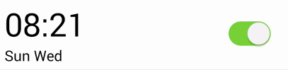

#Android 颜色属性动画.md

要在Android上做出Color过度的动画真的不容易。

在iOS上面，我们一句话就能搞定:

```
[UIView animateWithDuration:0.2
     animations:^{
         cell.backgroundColor = [UIColor colorWithString:@"#f0eff4"];
     }];

```

多么简单啊！！！

一开始我用`ValueAnimator`从0xffffff到0x000000进行过度，这样变化的过程中，红绿蓝都出来了，看来我太天真了。

下面的实现方法是参考[stackoverflow](http://stackoverflow.com/questions/18216285/android-animate-color-change-from-color-to-color)

我封装了一个`ColorAnimator`类

```
public class ColorAnimator {
    private int fromColor;
    private int toColor;
    private long duration;
    private OnUpdateColorCallback callback;

    public interface OnUpdateColorCallback{
        void onUpdateColor(int color);
    }

    public ColorAnimator() {
        fromColor = Color.WHITE;
        toColor = Color.WHITE;
        duration = 200;
    }

    public static ColorAnimator create(int fromColor, int toColor, long duration, OnUpdateColorCallback callback) {
        ColorAnimator colorAnimator = new ColorAnimator();
        colorAnimator.fromColor = fromColor;
        colorAnimator.toColor = toColor;
        colorAnimator.duration = duration;
        colorAnimator.callback = callback;
        return colorAnimator;
    }

    public void start() {
        if (Build.VERSION.SDK_INT >= Build.VERSION_CODES.ICE_CREAM_SANDWICH) { //4.0.1
            final float[] from = new float[3], to = new float[3];
            Color.colorToHSV(fromColor, from);
            Color.colorToHSV(toColor, to);
            ValueAnimator animator = ValueAnimator.ofFloat(0, 1);
            animator.setDuration(duration);
            final float[] hsv = new float[3];
            animator.addUpdateListener(new ValueAnimator.AnimatorUpdateListener() {
                @Override
                public void onAnimationUpdate(ValueAnimator animation) {
                    hsv[0] = from[0] + (to[0] - from[0]) * animation.getAnimatedFraction();
                    hsv[1] = from[1] + (to[1] - from[1]) * animation.getAnimatedFraction();
                    hsv[2] = from[2] + (to[2] - from[2]) * animation.getAnimatedFraction();
                    //holder.contentView.setBackgroundColor(Color.HSVToColor(hsv));
                    if (callback != null) {
                        callback.onUpdateColor(Color.HSVToColor(hsv));
                    }
                }
            });
            animator.start();
        } else {
            if (callback != null){
                callback.onUpdateColor(toColor);
            }
        }
    }

}
```

使用：

```
ColorAnimator.create(Color.parseColor("#ffffff"), Color.parseColor("#f0eff4"), 200, new ColorAnimator.OnUpdateColorCallback() {
    @Override
    public void onUpdateColor(int color) {
        holder.contentView.setBackgroundColor(color);
    }
}).start();
```

最终效果：

