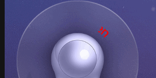
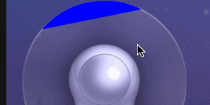
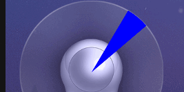
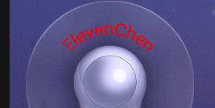

#Android文字逐现

##从左到右出，从左到右消失。

效果图:



###首先要实现的是文字在弧形上面显示。用`Canvas.drawTextOnPath`这个函数。

drawText函数会把文字画到路径上，然后返回一张位图。路径是一个圆形，然后还要计算偏移位置，使文字刚好在正中间。

```
private Bitmap drawText() {
    Bitmap bitmap = Bitmap.createBitmap(getWidth(), getWidth(), Bitmap.Config.ARGB_8888);
    Canvas canvas = new Canvas(bitmap);
    Paint paint = new Paint();
    paint.setColor(Color.parseColor("#00ffffff"));
    paint.setAntiAlias(true);
    paint.setStrokeWidth(1);
    paint.setStyle(Paint.Style.FILL); // 填充
    paint.setTextSize(FONT_SIZE);

    String string = mText;
    if (string == null) {
        Log.d(TAG, "string is null");
        return null;
    }
    float textLength = paint.measureText(string);

    Path path = new Path();
    int r = RADIUS;                                        // 圆的半径
    float c = (float)(r*2*Math.PI);                     // 圆的周长
    float offset = c / 4.0f * 3.0f - textLength/2.0f;   // 字体的长度在路径上的偏移量。
    float degree = (offset / c) * 360.0f;               // 画布需要旋转的角度
    mStartDegree = degree;
    mWeepDegree = (textLength / c) * 360.0f;
    canvas.save();
    canvas.rotate(degree,canvas.getWidth()/2, canvas.getHeight()/2);
    path.addCircle(getWidth()/2, getHeight() * 0.35f, r, Path.Direction.CW);
    canvas.drawPath(path, paint);

    paint.setColor(Color.RED);
    canvas.drawTextOnPath(string, path,0,0,paint);

    canvas.restore();
    return bitmap;
}
```

###画扇形

在Android上画扇形可以用`Canvas.drawArc()`这个函数。
第一个参数是一个椭圆区域，第二个参数是开始角度，第三个参数是跨度，就是跨越多少度，第四个参数是是否用中心点，第五个参数是笔刷。

第四个参数设置为false效果：



true效果:



从左到右出：

```
canvas.drawArc(oval, mStartDegree, mCurrentDegree, true, paint); // 从左到右
```

从左到右关：

```
canvas.drawArc(oval, mStartDegree + mWeepDegree - mCurrentDegree, mCurrentDegree, true, paint);
```

每次onDraw()的时候增加mCurrentDegree的值


###把蓝色的矩形换成扇形文字的图片

要实现这个效果，就需要用到BitmapShader。

```
Shader sharder = new BitmapShader(mTextBitmap, Shader.TileMode.REPEAT, Shader.TileMode.CLAMP);
paint.setShader(sharder);
```

这样就会用图片当场画笔的纹理。

###扩展
还可以做成从中间到两边、从上到下呢。


