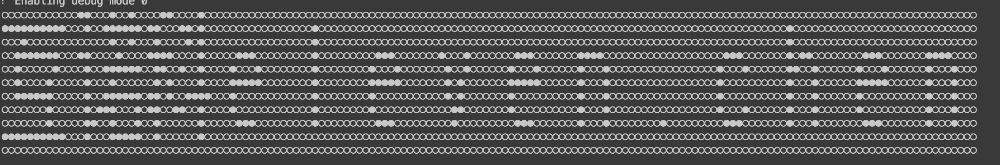

#Android读取文字的像素矩阵

###需求
公司项目需要把一个字的点阵发送到硬件的LED设备上，然后显示出来。一开始接到这个任务真的头都大了。
第一种尝试是下载字库，网上有16x16的字库。但是项目需要是11x11的，所以不行。
第二种尝试是首先把字画到位图上，然后再读取位图的颜色值，转换成11x11的矩阵。

原来是通过设置字的大小为11，然后把字画在11x11的bitmap上。再从bitmap上获取像素数据进行判断

```
/**
* 获取文本的矩阵数据
* @param text
* @return
*/
public byte[] getFontMatrixData(String text)
{
   Paint textPaint = new Paint();
   textPaint.setColor(Color.RED);
   textPaint.setTextSize(11);
   Bitmap bitmap = Bitmap.createBitmap(text.length() * 11, 11, Bitmap.Config.ARGB_8888);
   Canvas newCanvas = new Canvas(bitmap);
   newCanvas.drawColor(Color.RED);
   textPaint.setColor(Color.BLUE);
   for(int i = 0; i < text.length(); i++) {
       float w = textPaint.measureText(Character.toString(text.charAt(i)));
       //Log.d(TAG, "w: " + w);
       newCanvas.drawText(Character.toString(text.charAt(i)), i * 11 + (11-w)/2, 9, textPaint);
   }
   int[] data = new int[bitmap.getWidth() * bitmap.getHeight()];
   bitmap.getPixels(data, 0, bitmap.getWidth(), 0, 0, bitmap.getWidth(), bitmap.getHeight());

   for (int i = 0; i < bitmap.getHeight(); i++) {
       StringBuffer subBuffer = new StringBuffer();
       for (int j = 0; j < bitmap.getWidth(); j++) {
           // 打印蓝色出来
           //Log.d(TAG, "i: " + i + " j: " + j + " index: " + (i*bitmap.getWidth() + j));
           int blueValue = Color.blue(data[i * bitmap.getWidth() + j]);
           if(blueValue == 255){
               subBuffer.append("●");
           } else {
               subBuffer.append("○");
           }
       }
       Log.d(TAG, subBuffer.toString());
       //stringBuffer.append(subBuffer.toString());
       //stringBuffer.append("\n");
   }
   return null;
}
```

效果图:

