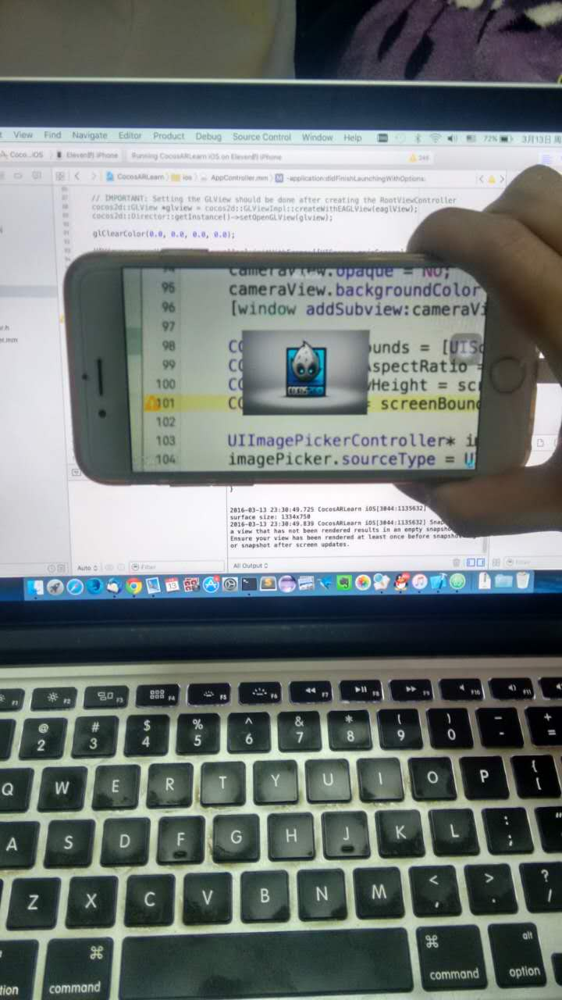

# 在Cocos2d-X加入摄像头做背景

因为用到了UIImagePickerController，现在项目配置general -> device orientation勾上Portait，如果不勾上会报错。

然后在AppController.mm里加入以下代码

```
eaglView.backgroundColor = [UIColor clearColor];
eaglView.opaque = NO;

glClearColor(0.0, 0.0, 0.0, 0.0);

UIView* cameraView = [[UIView alloc] initWithFrame:[[UIScreen mainScreen] bounds]];
cameraView.opaque = NO;
cameraView.backgroundColor = [UIColor clearColor];
[window addSubview:cameraView];

CGSize screenBounds = [UIScreen mainScreen].bounds.size;
CGFloat cameraAspectRatio = 4.0f/3.0f;
CGFloat camViewHeight = screenBounds.width * cameraAspectRatio;
CGFloat scale = screenBounds.height / camViewHeight;

UIImagePickerController* imagePicker = [[UIImagePickerController alloc] init];
imagePicker.sourceType = UIImagePickerControllerSourceTypeCamera;
imagePicker.showsCameraControls = NO;
imagePicker.toolbarHidden = YES;
imagePicker.navigationBarHidden = YES;
imagePicker.wantsFullScreenLayout = YES;
imagePicker.cameraViewTransform = CGAffineTransformMakeTranslation(0, (screenBounds.height - camViewHeight) / 2.0);
imagePicker.cameraViewTransform = CGAffineTransformRotate(imagePicker.cameraViewTransform, M_PI/2 * 3);

[cameraView addSubview:imagePicker.view];

[window bringSubviewToFront:_viewController.view];
```


