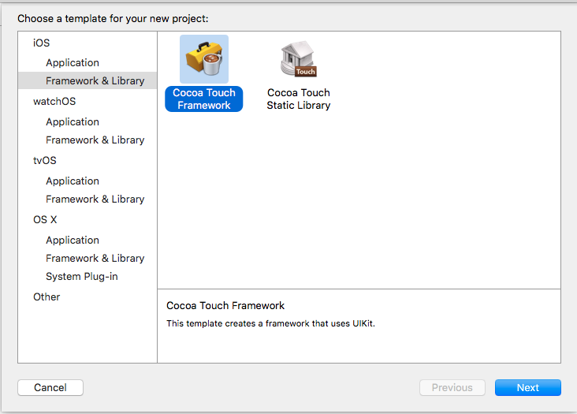
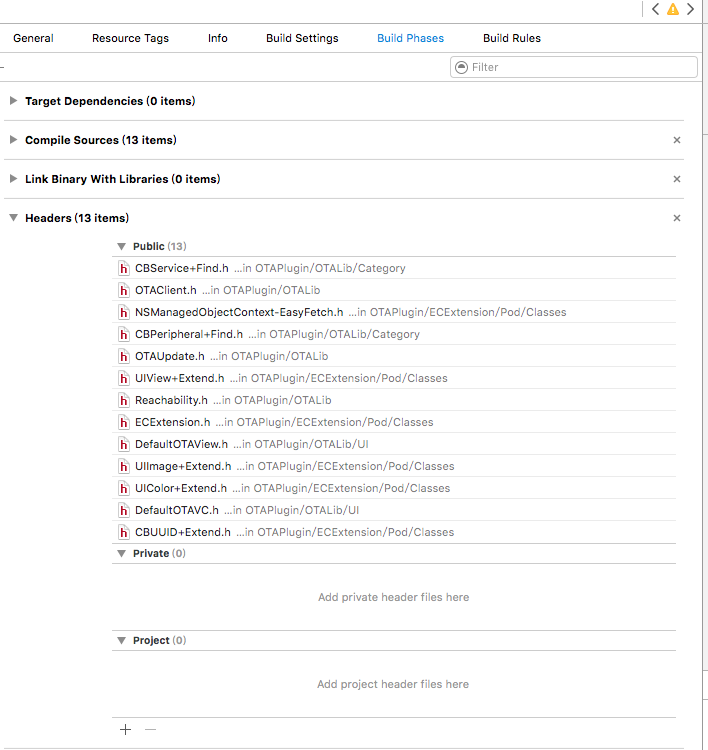
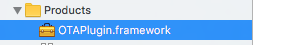

# 创建bundle和frameworkd

## 创建framework

1. 新建一个framework项目

2. 加入文件，和选择头文件，如果不把头文件拖到public那里，那么引用的时候就会找不到头文件

3. command + b 编译项目。framework会在Products group下，右键Show In Finder。这就是我们的framework了。

4. 把framework拖到其他项目里，会出现`dyld: Library not loaded`。

	需要在Genral里，把framework添加到`Embedded Binaries`
	
## 创建Bundle

创建一个Bundle项目，然后步骤跟上面一样。构建后在Products group下找到构建好的bundle