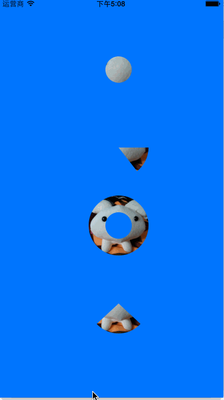

#iOS CGContextClip动画效果

主要用到CGContextClip()和CGContextEOClip()两个函数。

用当前的context的path作为裁剪的路径。

CGContextClip使用的是非零环绕数规则（Nonzero Winding Number Rule）

CGContextEOClip使用)奇-偶规则（Odd-even Rule）

效果图：



代码:

```
//
//  ClipView.m
//  Core Graphics Test
//
//  Created by Eleven Chen on 15/6/29.
//  Copyright (c) 2015年 Eleven. All rights reserved.
//

#import "ClipView.h"
static inline float radians(double degrees) { return degrees * M_PI / 180; }

@interface ClipView()
@property float angle;
@property float radius;
@property float angle2;
@end

@implementation ClipView


- (void)awakeFromNib {
    self.angle = 60;
    self.radius = 0;
    self.angle2 = 90;
    [NSTimer scheduledTimerWithTimeInterval:0.05 target:self selector:@selector(updateRadius:) userInfo:nil repeats:YES];
    [NSTimer scheduledTimerWithTimeInterval:0.05 target:self selector:@selector(updateAngle:) userInfo:nil repeats:YES];
    [NSTimer scheduledTimerWithTimeInterval:0.01 target:self selector:@selector(updateAngleTo180:) userInfo:nil repeats:YES];
}

- (void) updateRadius: (NSTimer*) timer {
    static BOOL revert = false;

    if (self.radius == 50) {
        revert = YES;
    } else if (self.radius == 0) {
        revert = NO;
    }

    if (revert) {
        self.radius--;
    } else {
        self.radius++;
    }
    [self setNeedsDisplay];
}

- (void) updateAngle: (NSTimer*) timer {
    static BOOL revert = false;

    if (self.angle == 360) {
        revert = YES;
    } else if (self.angle == 0) {
        revert = NO;
    }
    if (revert) {
        self.angle-=4;
    } else {
        self.angle+=4;
    }
    [self setNeedsDisplay];

}

- (void) updateAngleTo180: (NSTimer*) timer {
    static BOOL revert = false;
    if (self.angle2 >= 180) {
        revert = YES;
    } else if (self.angle2 <= 0) {
        revert = NO;
    }
    if (revert) {
        self.angle2 -= 1;
    } else {
        self.angle2 += 1;
    }
    [self setNeedsDisplay];
}

// Only override drawRect: if you perform custom drawing.
// An empty implementation adversely affects performance during animation.
- (void)drawRect:(CGRect)rect {
    // Drawing code

    UIImage *logo = [UIImage imageNamed:@"logo.jpg"];

    CGContextRef ctx = UIGraphicsGetCurrentContext();
    CGContextSetRGBFillColor(ctx, 1, 0, 0, 1);
    CGContextSetRGBStrokeColor(ctx, 0, 0, 0, 1);

    // 第一个圆
    CGContextSaveGState(ctx);
    CGContextMoveToPoint(ctx, 200, 120);
    CGContextAddArc(ctx, 200, 120, self.radius, 0, radians(360), 0);
    CGContextSetRGBFillColor(ctx, 0, 1, 0, 1);

    CGContextClip(ctx);
    [logo drawInRect:CGRectMake(150, 70, 100, 100)];
    CGContextRestoreGState(ctx);

    // 第二个圆
    CGContextSaveGState(ctx);
    CGContextMoveToPoint(ctx, 200, 250);
    CGContextAddArc(ctx, 200, 250, 50, radians(0), radians(self.angle), 0);
    CGContextClosePath(ctx);
    CGContextClip(ctx);
    CGRect aRect = CGRectMake(150, 200, 100, 100);
    [logo drawInRect:aRect];
    CGContextRestoreGState(ctx);

    // 第三个圆
    CGContextSaveGState(ctx);
    CGContextMoveToPoint(ctx, 200, 380);
    CGContextAddArc(ctx, 200, 380, self.radius, 0, radians(360), 0);
    CGContextAddArc(ctx, 200, 380, 50, 0, radians(360), 0);

    CGContextEOClip(ctx);
    CGRect rect3 = CGRectMake(150, 330, 100, 100);
    [logo drawInRect:rect3];
    CGContextRestoreGState(ctx);

    // 第四个圆
    CGContextSaveGState(ctx);
    CGContextMoveToPoint(ctx, 200, 510);

    CGContextAddArc(ctx, 200, 510, 50, radians(270 - self.angle2), radians(270 + self.angle2), 0);
    CGContextClosePath(ctx);
    CGContextAddArc(ctx, 200, 510, 50, radians(0), radians(360), 0);
//    if (self.angle2 <180) {
//        CGContextAddArc(ctx, 200, 510, 50, radians(90), radians(180 - self.angle2), 1);
//    } else {
//        CGContextAddArc(ctx, 200, 510, 50, radians(90), radians(540 - self.angle2), 1);
//    }


    CGContextEOClip(ctx);
    CGRect rect4 = CGRectMake(150, 460, 100, 100);
    [logo drawInRect:rect4];
    CGContextRestoreGState(ctx);

}


@end

```

参考：[非零环绕数规则和奇-偶规则（Non-Zero Winding Number Rule&&Odd-even Rule）](http://www.verydemo.com/demo_c134_i2057.html)
