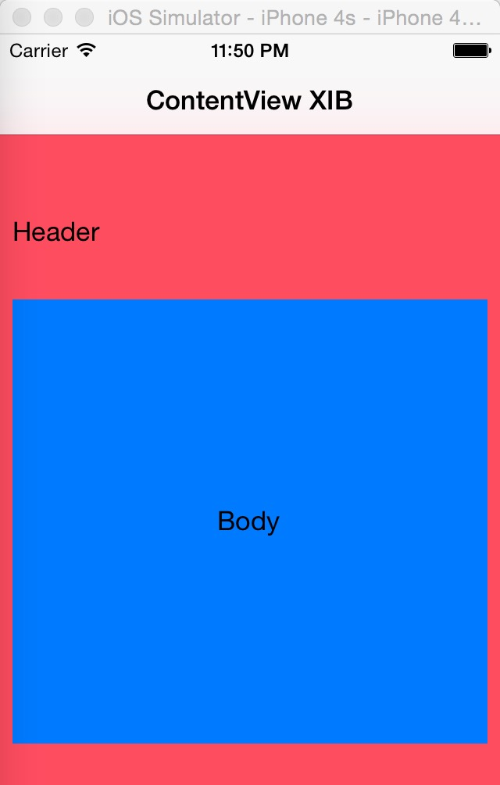
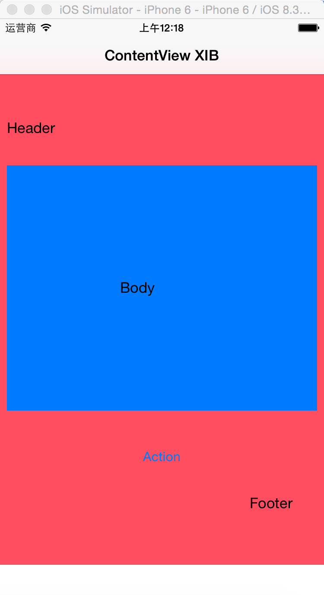

#ScrollViewAutoLayout

>UIScrollView And Autolayout

Screenshots

在4s和5s上面，会出现滚动条，因为contentview的高度比屏幕高度小




在6上面不会出现滚动条。




##实现

contentView是用xib做的。

在viewDidLoaded里面加载进来，然后加到scrollview里面。

```
NSArray* nibs = [[NSBundle mainBundle] loadNibNamed:@"ContentView" owner:self options:nil];
    self.contentView = [nibs objectAtIndex:0];
    [self.scrollView addSubview:self.contentView];
```

然后在`updateViewConstraints`添加contentview到scrollview上下左右的约束

```
    [self.scrollView addConstraint:[NSLayoutConstraint constraintWithItem:self.contentView
                                                          attribute:NSLayoutAttributeTop
                                                          relatedBy:NSLayoutRelationEqual
                                                             toItem:self.scrollView
                                                          attribute:NSLayoutAttributeTop
                                                         multiplier:1.0f
                                                           constant:0]];
    [self.scrollView addConstraint:[NSLayoutConstraint constraintWithItem:self.contentView
                                                          attribute:NSLayoutAttributeTrailing
                                                          relatedBy:NSLayoutRelationEqual
                                                             toItem:self.scrollView
                                                          attribute:NSLayoutAttributeRight
                                                         multiplier:1.0f
                                                           constant:0]];
    [self.scrollView addConstraint:[NSLayoutConstraint constraintWithItem:self.contentView
                                                          attribute:NSLayoutAttributeBottom
                                                          relatedBy:NSLayoutRelationEqual
                                                             toItem:self.scrollView
                                                          attribute:NSLayoutAttributeBottom
                                                         multiplier:1.0f
                                                           constant:0]];
    [self.scrollView addConstraint:[NSLayoutConstraint constraintWithItem:self.contentView
                                                          attribute:NSLayoutAttributeLeading
                                                          relatedBy:NSLayoutRelationEqual
                                                             toItem:self.scrollView
                                                          attribute:NSLayoutAttributeLeft
                                                         multiplier:1.0f
                                                           constant:0]];
```

这时候，contentview的width和height都是不正确。要令contentview的width是最上层父view的width，height是contentview设计时的height。

```
self.contentView.translatesAutoresizingMaskIntoConstraints = NO;
    NSNumber *height = [NSNumber numberWithFloat:self.contentView.bounds.size.height];

    [self.contentView addConstraints:[NSLayoutConstraint constraintsWithVisualFormat:@"V:[self(==height)]"
                                                                             options:0
                                                                             metrics:@{@"height": height}
                                                                               views:@{@"self": self.contentView}]];
    NSDictionary *views = @{@"contentView": self.contentView};
    [self.scrollView addConstraints:[NSLayoutConstraint constraintsWithVisualFormat:@"H:|[contentView(==width)]|"
                                                                      options:0
                                                                      metrics:@{@"width": [NSNumber numberWithFloat:self.view.bounds.size.width]}
                                                                        views:views]];
```

[Source](https://github.com/skyhacker2/iOS-ScrollViewAutoLayout)

##Reference

[http://spin.atomicobject.com/2014/03/05/uiscrollview-autolayout-ios/](http://spin.atomicobject.com/2014/03/05/uiscrollview-autolayout-ios/)
