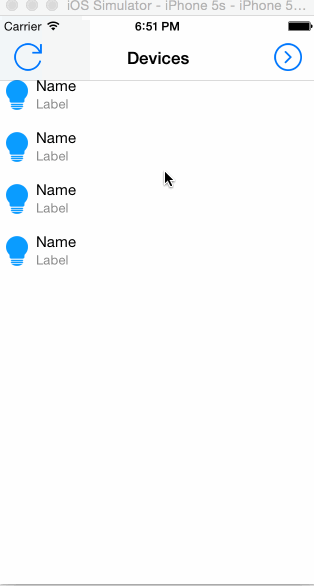

#iOS 使用CATransition实现ViewController自定义跳转效果

##从右到左进

```
+ (CATransition*) pushTransition
{
    CATransition *transition = [CATransition animation];
    transition.duration = 0.3;
    transition.timingFunction = [CAMediaTimingFunction functionWithName:kCAMediaTimingFunctionEaseInEaseOut];
    transition.type = kCATransitionPush;
    transition.subtype = kCATransitionFromRight;
    return transition;
}
```

##从左到右进

```
+ (CATransition*) popTransition
{
    CATransition *transition = [CATransition animation];
    transition.duration = 0.3;
    transition.timingFunction = [CAMediaTimingFunction functionWithName:kCAMediaTimingFunctionEaseInEaseOut];
    transition.type = kCATransitionPush;
    transition.subtype = kCATransitionFromLeft;
    return transition;
}
```

##调用

```
[self.view.window.layer addAnimation:[Utility pushTransition] forKey:nil];

[self presentViewController:controller animated:NO completion:nil];
```

##效果图


