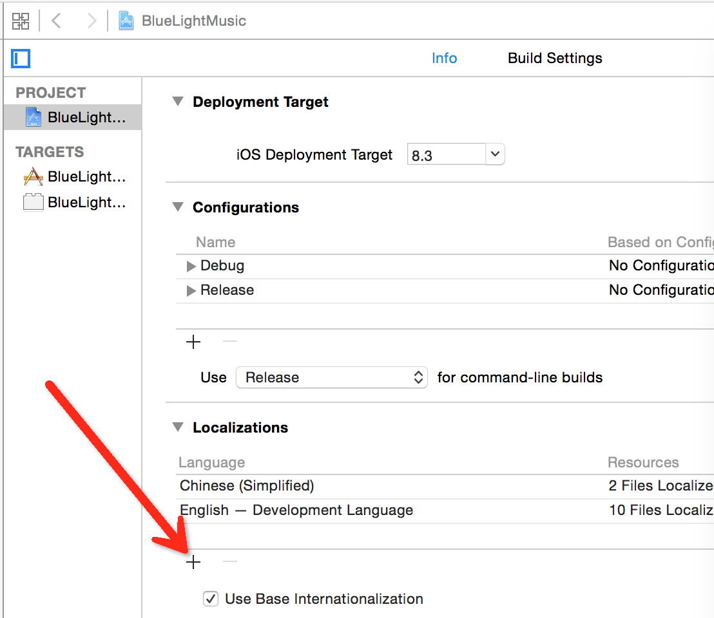
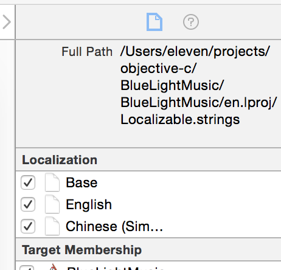

#iOS 国际化

## 添加支持的语言



## 添加strings

File->New File->Resource->Strings File

名字填默认的名字`Localizable.strings`

添加对应的语言版本



## 在代码中使用

NSLocalizedString(key, comment) 默认在`Localizable.strings`文件中查找key对应的文本

还有：

```
NSString *NSLocalizedStringFromTable(NSString *key, NSString *tableName, NSString *comment)
在mainbundle中的tableName.strings中查找对应的文本
```

```
NSString *NSLocalizedStringFromTableInBundle(NSString *key, NSString *tableName, NSBundle *bundle, NSString *comment)
在指定的bundle中的指定的tablename.strings中查找
```

## 小工具
[android string.xml翻译](http://members.home.nl/bas.de.reuver/files/stringsconvert.html)

##Reference
[https://developer.apple.com/library/mac/documentation/Cocoa/Reference/Foundation/Miscellaneous/Foundation_Functions/#//apple_ref/c/macro/NSLocalizedStringFromTableInBundle](https://developer.apple.com/library/mac/documentation/Cocoa/Reference/Foundation/Miscellaneous/Foundation_Functions/#//apple_ref/c/macro/NSLocalizedStringFromTableInBundle)
