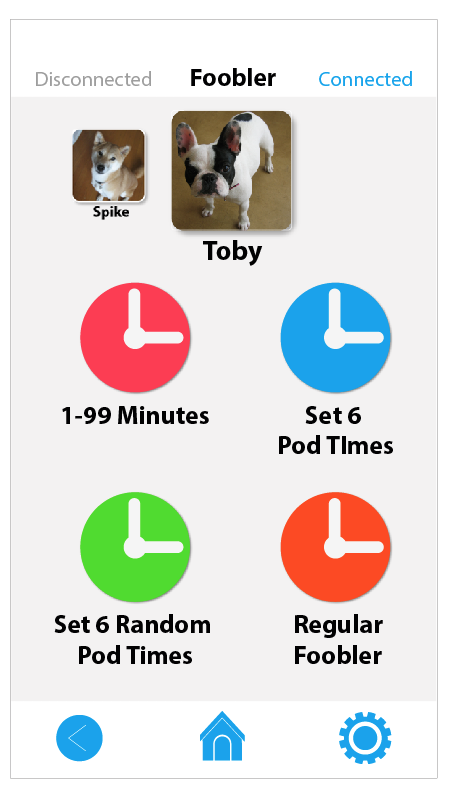
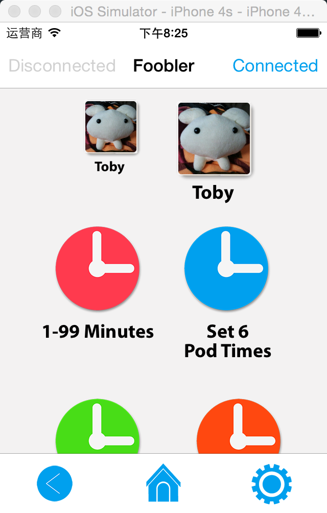
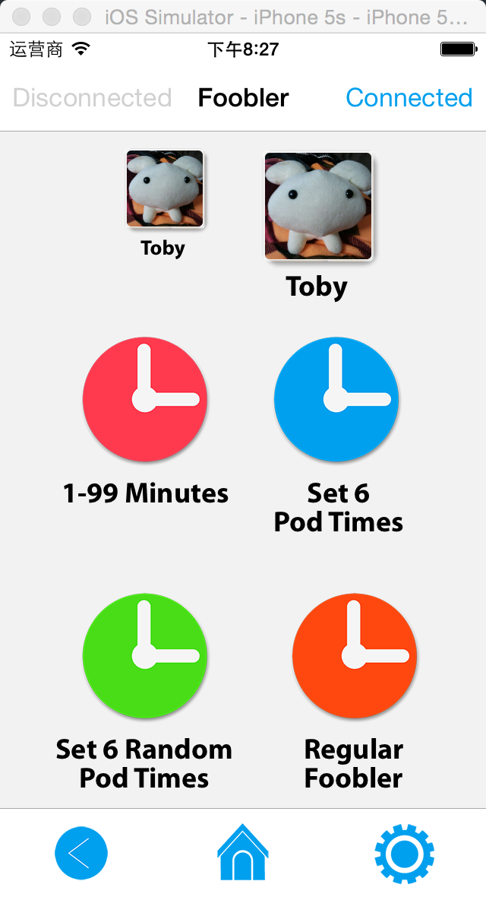
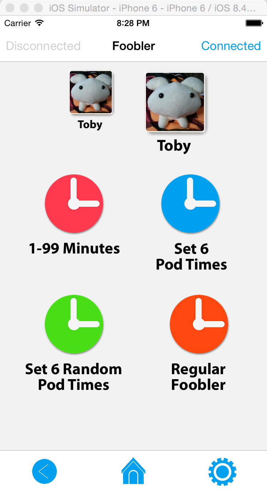
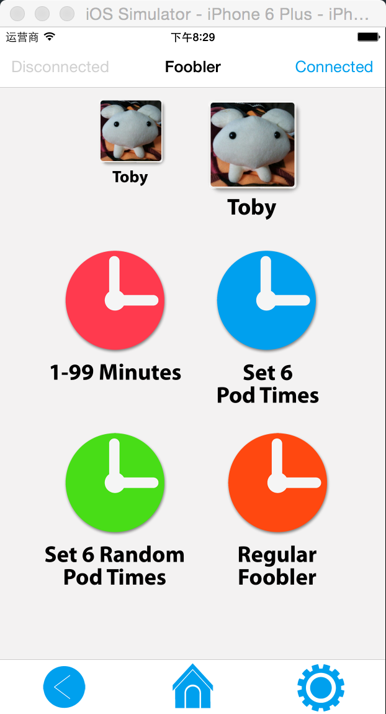
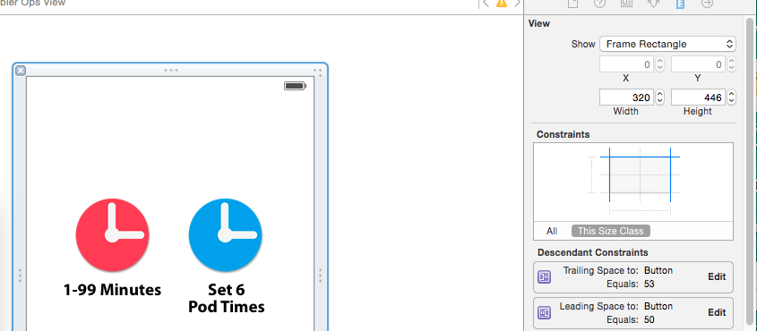

#iOS 屏幕适配

## 设计图的界面


## 4S效果


## 5S效果


## 6效果


## 6 Plus


##解决方案

当然原则是尽最大的可能还原设计图的效果。

我采用的方法是是5s显示的效果最接近设计图，4S会出现滚动条，6和6 plus适当放大。

我的界面是大多数使用xib排的，小部分使用代码。

xib的设计尺寸是320 446，保证在5s上不会被缩放。



实现BaseController的loadView

```
- (UIView*) getContentView
{
    NSLog(@"请实现 %s", __FUNCTION__);
    return nil;
}

- (void) loadView
{
    UIView* contentView = [self getContentView];
    if (contentView == nil) {
        return;
    }
    CGSize winSize = [UIScreen mainScreen].bounds.size;
    UIScrollView* scrollView = [[UIScrollView alloc] init];

    CGFloat scale = winSize.width / contentView.bounds.size.width;
    scrollView.contentSize = CGSizeMake(winSize.width,contentView.bounds.size.height * scale);
    [scrollView addSubview:contentView];
    contentView.translatesAutoresizingMaskIntoConstraints = NO;
    [contentView layoutMarginLeftSuperView:0];
    [contentView layoutMarginTopSuperView:0];
    [contentView constraintSize:CGSizeMake(winSize.width, contentView.bounds.size.height * scale)];

    UIView* view = [[UIView alloc] init];
    [view addSubview:scrollView];
    scrollView.translatesAutoresizingMaskIntoConstraints = NO;
    [scrollView layoutMatchSuperView];
    self.view = view;
}
```

子类要实现`getContentView`方法返回一个内容视图，然后会按照`scale`来缩放宽高。

```
- (UIView*) getContentView
{
    self.contentView = [UIView loadFromNibWithName:@"FooblerOps" ower:self];
    self.htableView = self.contentView.htableView;
    return self.contentView;
}
```

文本并不会跟着界面进行缩放，在6 plus上看到的字体会变的比较小。我在view里面的`awakeFromNib`方法加上放大文本的方法。

```
- (void) awakeFromNib
{
    [self scaleUILabel:FONT_SCALE];
}
```

```
#define FONT_SCALE ([UIScreen mainScreen].bounds.size.width / 320.f)
```

```
@interface UIView (Scale)

/// 缩放UILabel
- (void) scaleUILabel:(CGFloat) scale;

@end

@implementation UIView (Scale)
- (void) scaleUILabel:(CGFloat) scale
{
    for (UIView* view in self.subviews) {
        if ([view isKindOfClass:[UILabel class]]) {
            UILabel* label = (UILabel*) view;
            UIFont *font = label.font;
            font = [UIFont fontWithDescriptor:font.fontDescriptor size:font.pointSize * scale];
            label.font = font;
        }
    }
}
@end
```

这时候看到的效果已经好了很多了，但是控件摆放的位置在6 plus上好像不太对，因为我设置的约束是固定值，我需要把约束也要缩放。

这里不知道怎样在interface builder里面设置约束根据屏幕宽度改变，只好每一个界面把约束拉到view里面用代码实现。

```
@property (strong, nonatomic) IBOutletCollection(NSLayoutConstraint) NSArray *spaceContraints;
```

```
- (void) awakeFromNib
{
    [self scaleUILabel:FONT_SCALE];

    // 缩放约束
    for (int i = 0; i < [self.spaceContraints count]; i++) {
        NSLayoutConstraint* constraint = (NSLayoutConstraint*)[self.spaceContraints objectAtIndex:i];
        constraint.constant *= SCALE;
    }
}
```

现在看到的效果就是一开始的时候的效果，其实还好，就是有点麻烦。。。
