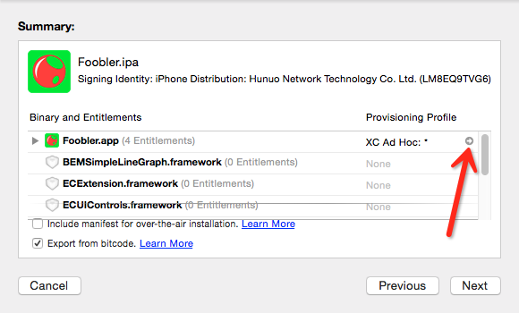
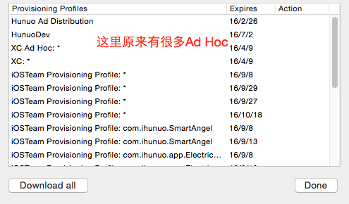

# iOS 更新provisioning profile.md

在Member Center上面加入了Devices，然后进行ad-hoc打包，但是打出来的包并没有包括新加入的UUID。

然后我把provisioning file重新下载下来安装。

这时再进行打包，UUID还是没有加进去。

我就郁闷了。

认真看了ad-hoc的打包界面。我发现了一个小箭头：

当点击这个箭头，会跳到Provisioning Profiles文件夹里面的一个mobileprovision文件。

用记事本打开这个文件，发现里面没有新加的UUID。

我又郁闷了，猜测这是以前的mobileprovision文件。因为这个文件夹里面有很多mobileprovision。

在Accounts账号的detail页面，发现了很多XC Ad Hoc:* 。

右击一个XC Ad Hoc可以跳到对应的provisioning文件。

然后我一个个打开看，最终又一个有新加的设备。然后我就把其他的删除掉。

这是重新打包，终于有了新的设备。

更新provision profile文件的时候其实到account里面download all应该就可以了。
