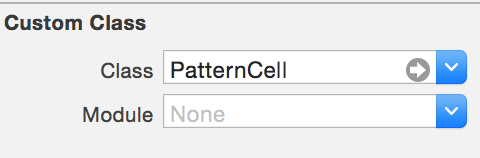
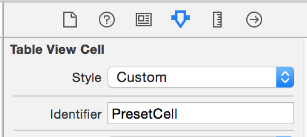
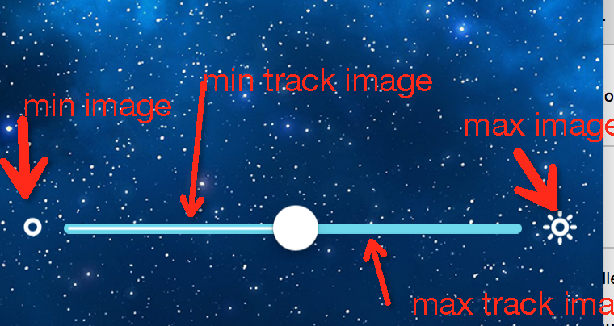

#iOS 开发记录2

##自定义UIView设置背景透明

需要在init里面设置`opaque = NO`

##自定义UITableViewCell设置背景透明和选中的背景颜色
不知道为什么在xib中设置了不起效~囧

```
- (void)awakeFromNib {
    // Initialization code
    self.opaque = NO;
    self.backgroundColor = [UIColor clearColor];
    UIView *selectedView = [[UIView alloc]init];
    selectedView.backgroundColor = [UIColor colorWithRed:0 green:0 blue:0 alpha:0.2];
    self.selectedBackgroundView = selectedView;
}
```

##自定义UITableViewCell加载

1. 在xib文件中指定class



2. 增加一个prototype cell



3. 代码总注册nib文件

```
UINib* nib = [UINib nibWithNibName:@"PresetTableViewCell" bundle:nil];
[self.tableView registerNib:nib forCellReuseIdentifier:@"PresetCell"];
```
4. 代码返回view

```
- (UITableViewCell*) tableView:(UITableView *)tableView cellForRowAtIndexPath:(NSIndexPath *)indexPath
{
    UITableViewCell* cell = [tableView dequeueReusableCellWithIdentifier:@"PresetCell" forIndexPath:indexPath];
    if (cell == nil) {
        cell = [UIView loadFromNibWithName:@"PresetTableViewCell"];
    }
    return cell;
}
```

##改变UITableViewCell高度

先建一个原型cell，然后实现`- (CGFloat) tableView:(UITableView *)tableView heightForRowAtIndexPath:(NSIndexPath *)indexPath`

```
@property (strong, nonatomic) PatternCell* prototypeCell;

- (PatternCell*) prototypeCell
{
    if (_prototypeCell == nil) {
        _prototypeCell = [self.tableView dequeueReusableCellWithIdentifier:@"PresetCell"];
    }
    return _prototypeCell;
}
```

```
- (CGFloat) tableView:(UITableView *)tableView heightForRowAtIndexPath:(NSIndexPath *)indexPath
{
    return self.prototypeCell.frame.size.height;
}
```

##自定义UISlider



使用图片


```
- (void) setupBrightSlider
{
    float y = self.view.frame.size.height * 0.75;
    self.brightSlider = [[UISlider alloc] initWithFrame:CGRectMake(16, y, self.view.bounds.size.width-32, 30)];
    UIImage *trackImage = [[UIImage imageNamed:@"ic_slider_bg"] stretchableImageWithLeftCapWidth:4 topCapHeight:0];
    UIImage *fgImage = [[UIImage imageNamed:@"ic_slider_fg"] stretchableImageWithLeftCapWidth:4 topCapHeight:0];
    [self.brightSlider setMaximumTrackImage:trackImage forState:UIControlStateNormal];
    [self.brightSlider setMinimumTrackImage:fgImage forState:UIControlStateNormal];
    self.brightSlider.minimumValueImage = [UIImage imageNamed:@"ic_bright_min.png"];
    self.brightSlider.maximumValueImage = [UIImage imageNamed:@"ic_bright_max.png"];
    self.brightSlider.value = 1.0f;
    [self.brightSlider addTarget:self action:@selector(brightChanged:) forControlEvents:UIControlEventValueChanged];
    [self.view addSubview:self.brightSlider];
}
```

`stretchableImageWithLeftCapWidth:width topCapHeight: height`方法有点类似Android的九宫格图缩放图片
