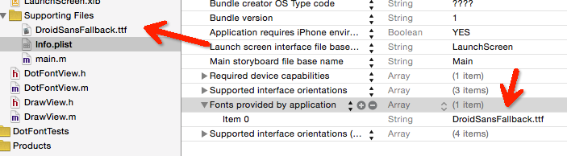

#ios使用ttf

首先把ttf文件拖到工程里面，然后在info.plist里面添加一行`Fonts provided by application`，填上ttf的名称。



用以下代码可以打印出全部的字体名称:

```
for(NSString *fontfamilyname in [UIFont familyNames])
{
    NSLog(@"family:'%@'",fontfamilyname);
    for(NSString *fontName in [UIFont fontNamesForFamilyName:fontfamilyname])
    {
        NSLog(@"\tfont:'%@'",fontName);
    }
    NSLog(@"-------------");
}
```

使用：

```
UIFont *font = [UIFont fontWithName:@"DroidSansFallback" size:size];
```
