# Cocos2d-x 3.1 Lua Binding #
参考：[http://www.cocos2d-x.org/docs/manual/code-ide/binding-custom-class-to-lua/en](http://www.cocos2d-x.org/docs/manual/code-ide/binding-custom-class-to-lua/en)

## 添加需要绑定的C++类 ##
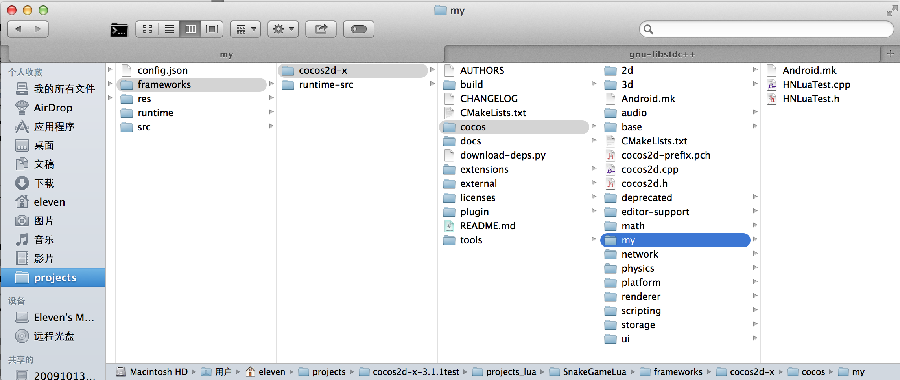

## 在xcode中，把my文件夹拖到cocos2d_libs.xcodeproj中 ##
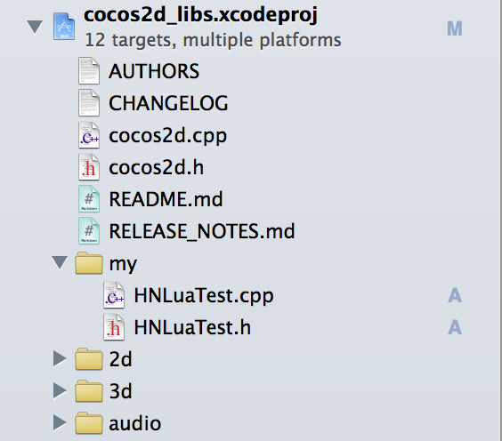

## HNLuaTest.h ##

```

//
//  HNLuaTest.h
//  cocos2d_libs
//
//  Created by Eleven Chen on 14-8-5.
//
//

#ifndef __cocos2d_libs__HNLuaTest__
#define __cocos2d_libs__HNLuaTest__

#include "cocos2d.h"
#include <string>


class Test : public cocos2d::Ref
{
public:
    
    static std::string helloMsg();
    
    static Test* create();
    
    bool init();
    static cocos2d::Vec2 left();
};

#endif /* defined(__cocos2d_libs__HNLuaTest__) */

```

## HNLuaTest.cpp ##

```
//
//  HNLuaTest.cpp
//  cocos2d_libs
//
//  Created by Eleven Chen on 14-8-5.
//
//

#include "HNLuaTest.h"
using namespace cocos2d;

std::string Test::helloMsg()
{
    return "Hello from  HNLuaTest::helloMsg()";
}

Test* Test::create()
{
    return new Test();
}

bool Test::init()
{
    return true;
}

Vec2 Test::left()
{
    return Vec2(0, 0);
}

```

## 编写ini文件 ##

进入到tolua目录：$(PROJECT_ROOT)/frameworks/cocos2d-x/tools/tolua

在之前先看看README文件，并安装好环境。

README文件中提到必须要用android ndk r9b来编译，因为编译的时候用到了C++ std 4.7的头文件，而r9b包含了4.7，我用的是r9d，只有4.6和4.8。我把*.ini文件里面的4.7改成4.8来编译。
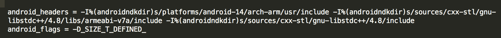

新建一个cocos2dx_custom.ini文件，然后从其他文件里面copy一份代码过来修改，代码里面每一个设置都有详细的注释。

```
[cocos2dx_custom]
# the prefix to be added to the generated functions. You might or might not use this in your own
# templates
prefix = cocos2dx_custom

# create a target namespace (in javascript, this would create some code like the equiv. to `ns = ns || {}`)
# all classes will be embedded in that namespace
target_namespace = cc

# the native namespace in which this module locates, this parameter is used for avoid conflict of the same class name in different modules, as "cocos2d::Label" <-> "cocos2d::ui::Label".
cpp_namespace = 

android_headers = -I%(androidndkdir)s/platforms/android-14/arch-arm/usr/include -I%(androidndkdir)s/sources/cxx-stl/gnu-libstdc++/4.8/libs/armeabi-v7a/include -I%(androidndkdir)s/sources/cxx-stl/gnu-libstdc++/4.8/include
android_flags = -D_SIZE_T_DEFINED_ 

clang_headers = -I%(clangllvmdir)s/lib/clang/3.3/include 
clang_flags = -nostdinc -x c++ -std=c++11

cocos_headers = -I%(cocosdir)s/cocos -I%(cocosdir)s/cocos/editor-support -I%(cocosdir)s/cocos/platform/android

cocos_flags = -DANDROID

cxxgenerator_headers = 

# extra arguments for clang
extra_arguments = %(android_headers)s %(clang_headers)s %(cxxgenerator_headers)s %(cocos_headers)s %(android_flags)s %(clang_flags)s %(cocos_flags)s %(extra_flags)s 

# what headers to parse
headers =  %(cocosdir)s/cocos/my/HNLuaTest.h

# what classes to produce code for. You can use regular expressions here. When testing the regular
# expression, it will be enclosed in "^$", like this: "^Menu*$".
classes = Test.*

# what should we skip? in the format ClassName::[function function]
# ClassName is a regular expression, but will be used like this: "^ClassName$" functions are also
# regular expressions, they will not be surrounded by "^$". If you want to skip a whole class, just
# add a single "*" as functions. See bellow for several examples. A special class name is "*", which
# will apply to all class names. This is a convenience wildcard to be able to skip similar named
# functions from all classes.

skip = 

rename_functions = 

rename_classes =

# for all class names, should we remove something when registering in the target VM?
remove_prefix = 

# classes for which there will be no "parent" lookup
classes_have_no_parents = Test

# base classes which will be skipped when their sub-classes found them.
base_classes_to_skip =

# classes that create no constructor
# Set is special and we will use a hand-written constructor
abstract_classes = 

# Determining whether to use script object(js object) to control the lifecycle of native(cpp) object or the other way around. Supported values are 'yes' or 'no'.
script_control_cpp = no

```

## 编写genbindings.py ##

为了方便，每次绑定时不需要生成cocos2d-x的绑定代码，新建一个`genbindings_custom.py`文件，然后复制`genbindings.py`的代码过来，把下面的地方：

```
cmd_args = {'cocos2dx.ini' : ('cocos2d-x', 'lua_cocos2dx_auto'), \
                    'cocos2dx_extension.ini' : ('cocos2dx_extension', 'lua_cocos2dx_extension_auto'), \
                    'cocos2dx_ui.ini' : ('cocos2dx_ui', 'lua_cocos2dx_ui_auto'), \
                    'cocos2dx_studio.ini' : ('cocos2dx_studio', 'lua_cocos2dx_studio_auto'), \
                    'cocos2dx_spine.ini' : ('cocos2dx_spine', 'lua_cocos2dx_spine_auto'), \
                    'cocos2dx_physics.ini' : ('cocos2dx_physics', 'lua_cocos2dx_physics_auto'), \
                    'custom.ini': ('custom', 'lua_custom_auto'), \
                    'cocos2dx_custom.ini' : ('cocos2dx_custom', 'lua_cocos2dx_custom_auto'), \
                    }

```

改为

```
 cmd_args = {'cocos2dx_custom.ini' : ('cocos2dx_custom', 'lua_cocos2dx_custom_auto'), \
                    }
```
## 运行genbindings_custom.py ##
```
 ./genbindings_custom.py 
```                   

生成的代码在 `cocos/scripting/lua-bindings/auto`里面
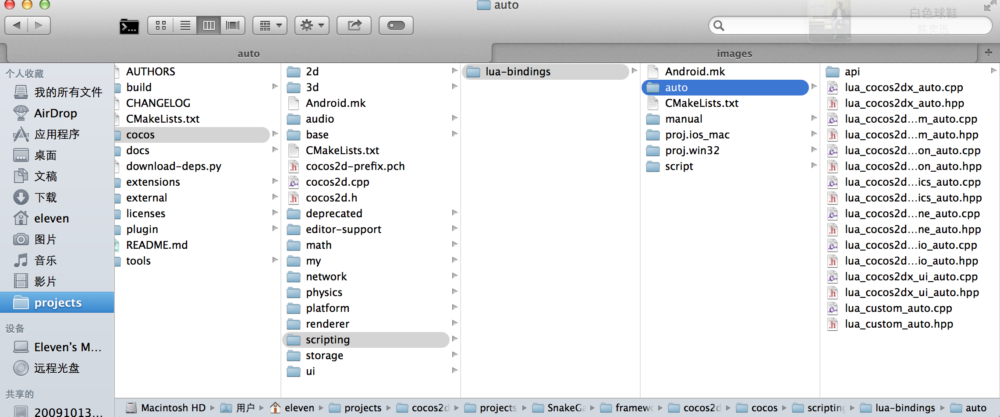

## mac和ios的集成 ##

* 把生成的hpp和cpp拖到cocos2d_lua_bindings.xcodeproj/auto中

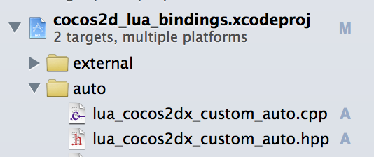

* 在cocos2d_lua_bindings.xcodeproj 的Build Settings中设置头文件搜索，添加`my`

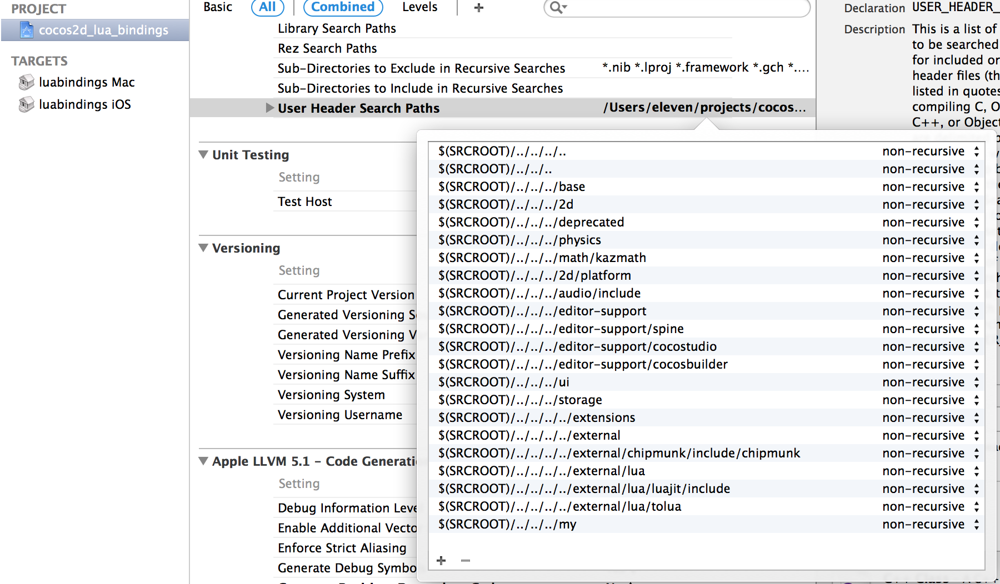

## Android集成 ##
* 在`my`文件夹中添加Android.mk文件，如下内容

```
LOCAL_PATH := $(call my-dir)
include $(CLEAR_VARS)

LOCAL_MODULE := cocos_custom_static

LOCAL_MODULE_FILENAME := libmy

LOCAL_SRC_FILES := \
HNLuaTest.cpp

LOCAL_EXPORT_C_INCLUDES := $(LOCAL_PATH) \
$(LOCAL_PATH)./

LOCAL_C_INCLUDES := $(LOCAL_PATH) \
$(LOCAL_PATH)./

LOCAL_CFLAGS += -Wno-psabi
LOCAL_EXPORT_CFLAGS += -Wno-psabi

LOCAL_WHOLE_STATIC_LIBRARIES := cocos2dx_static

include $(BUILD_STATIC_LIBRARY)

$(call import-module,.)

```

* 打开lua-bindings文件夹的Android.mk文件，添加以下内容
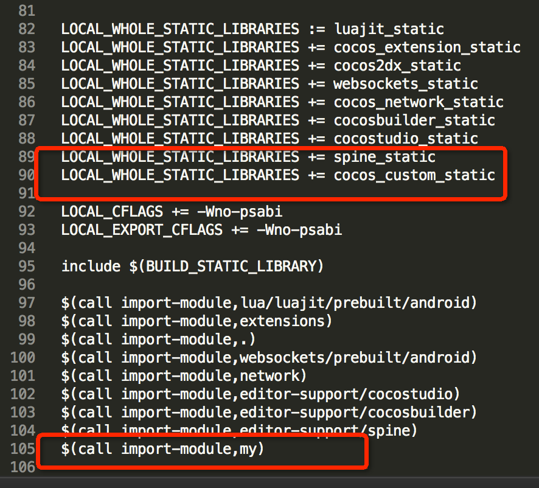


## 注册到Lua ##
修改`AppDelegate.cpp`

```
    
    //register custom function
    //LuaStack* stack = engine->getLuaStack();
    //register_custom_function(stack->getLuaState());
    LuaStack *stack = engine->getLuaStack();
    auto L = stack->getLuaState();
    if (L)
    {
        lua_getglobal(L, "_G");
        register_all_cocos2dx_custom(L);
        lua_settop(L, 0);
    }
    
#if (COCOS2D_DEBUG>0)
    if (startRuntime())
        return true;
#endif
    engine->executeScriptFile(ConfigParser::getInstance()->getEntryFile().c_str());
    return true;
```

这里不能按照原本代码注释的方法那样做，那样会出错。

而且都是`tolua_module`这个函数里面的` lua_rawget(L,-2);`这一行出错。

原因是：
1.  auto engine = LuaEngine::getInstance();
2.  _defaultEngine->init();
3.  executeScriptFile("Deprecated.lua");
4.  _stack->clean();
5.  lua_settop(_state, 0);

LuaEngine初始化的时候会运行3个lua文件，把stack给清空了。

在`tolua_module`函数中，`lua_pushstring(L,name);`后，栈只有一个元素，所以`lua_rawget(L,-2);`就会出错。

只需要把`_G`放到栈中，再运行`register_all_cocos2dx_custom(L);`，如果模块不在`_G`中，就添加到`_G`中，就可以全局访问了。

## cocos code ide build custom runtime ##

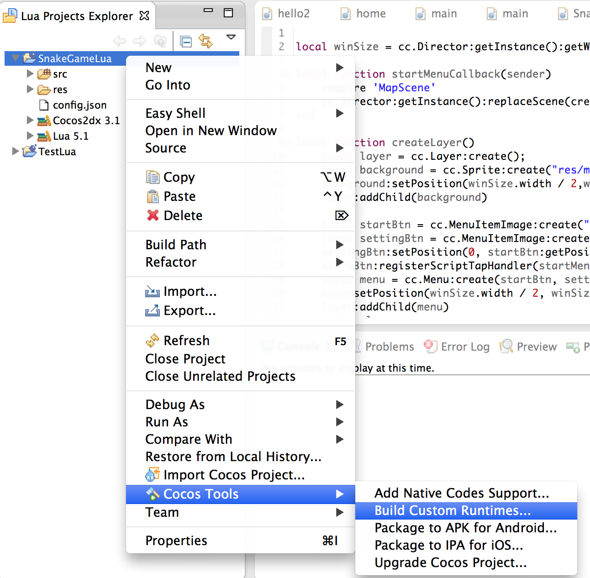

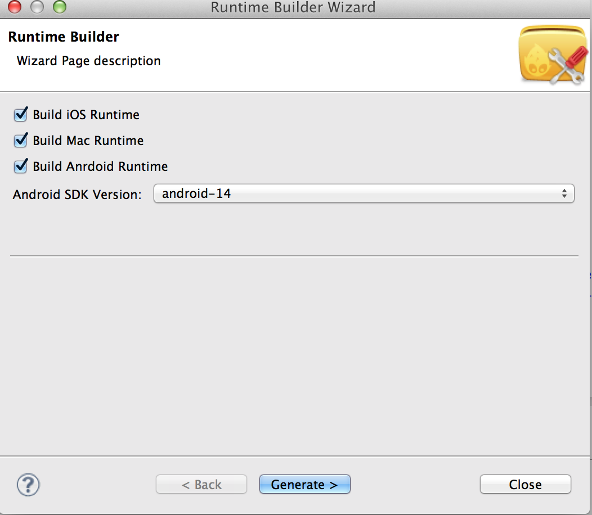

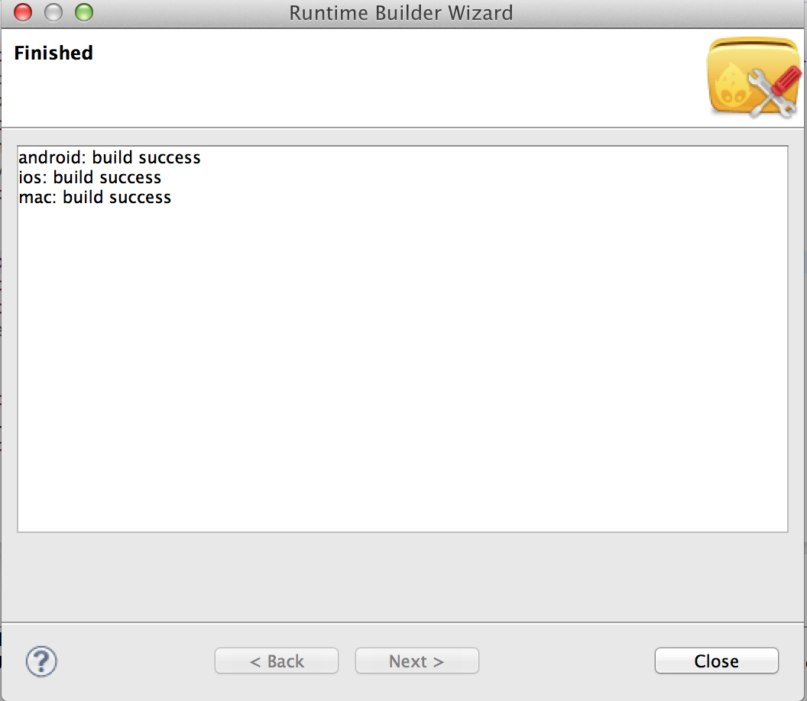

## 测试 ##

```
 -- test custom
 local msg = cc.Test:helloMsg()
 print(msg)

```
输出
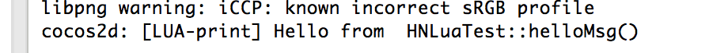

## 绑定不支持C++11 lambda表达式

## 绑定时候使用自己的命名空间

打开：cocos2d-x/tools/bindings-generator/targets/lua/conversions.yaml文件
在ns_map添加自己的命名空间：

```
  ns_map:
    "cocos2d::extension::": "cc."
    "cocos2d::ui::": "ccui."
    "cocos2d::": "cc."
    "spine::": "sp."
    "cocostudio::": "ccs."
    "cocosbuilder::": "cc."
    "CocosDenshion::": "cc."
    # 我自己的命名空间
    "hunuo::": "hn."

```