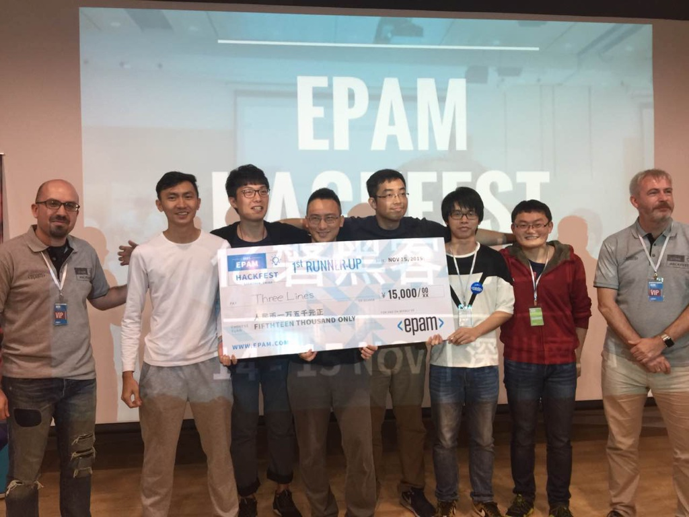

# Fuck2015 Shit2016

## 关于工作

公司没换，同事换了。今年有两个同事离职了，又来了两个同事。我的工作重点也从cocos2dx转移到iOS开发上来。今年负责开发了4个产品。均未上线，好惨。

## 关于学习

主要是学习了iOS的应用开发，应该是从6月份开始学，到现在已经半年了。当初选择oc没有swift感觉是明智的，像我们这种方案公司，一年多很多项目，然后每个项目也需要维护，一开始用swift1.x写的app，到swift2.x的时候各种编译问题，真是蛋碎。同时oc更好跟C++通讯，因为cocos2dx那边还是有很多东西需要绑定。今年还学了一点osx开发，希望能做一个蓝牙模拟器用来调试。

## 关于个人项目

今年做的个人项目比较少，好像就3个。水滴爆破、生活清单和孩子更像谁。可惜下载量都不多。今年总共收到的广告费有5K左右，全靠翻转方块有一个星期被小米推荐了。最惨的是PDF一段时间被小米下架，重新上架后好评全没了，我也把广告取消了，增加了一个赞助入口，可是总共才收到了20块赞助。另外还有一个游戏水豚君JumpJump在开发中，这个已经搞了一年了，断断续续的，也重构了两次，从cocos2d-js换会了cocos2dx，尝试用tiledmap来做地图。

## 黑客马拉松

今年参加了一次黑客马拉松。连续48小时，搞了一个蓝牙约炮App，居然获得了二等奖还有一个最佳设计奖，真是没想到。

## 2016年计划

1. 上架最少一个app到app store。
2. 写一个osx应用程序

## 最后说两句

想法太多，程序员太少。
