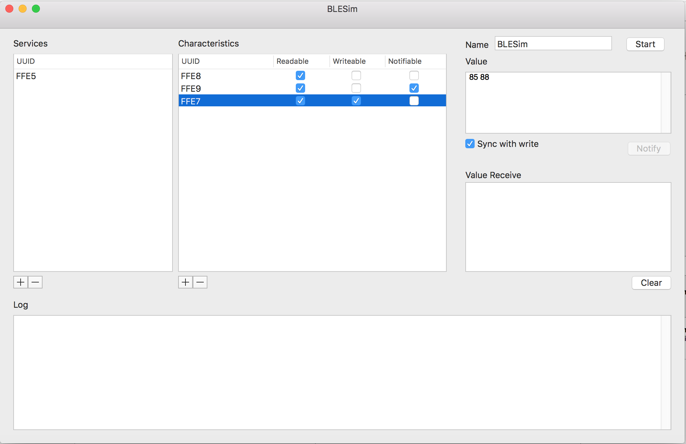

# BleSim
> 在OSX上模拟蓝牙4.0外设

<a class="download-btn" href="http://7sbkkt.com2.z0.glb.clouddn.com/BleSim.app.zip"><i class="fa fa-android"></i> 下载</a>

## 功能

1. 添加Service和Characteristic

2. Name是外围设备的名字。

3. 按Start启动。

4. 选择指定的Characteristic在右边的Value窗口设置值。

5. 勾选Sync with write的话，当收到write请求时会覆盖原来的值。

6. Notify按钮发送通知给Central。

7. Value Receive窗口列出每次write请求收到的值。
