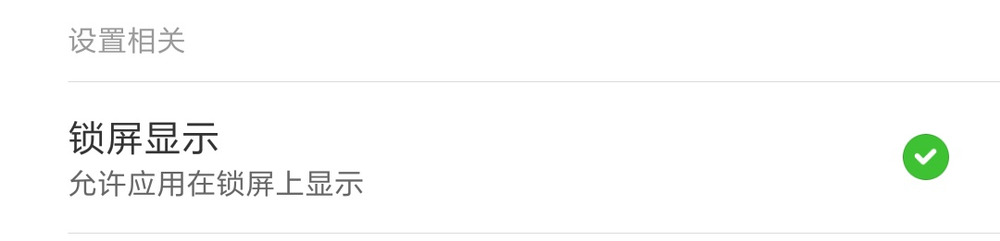

# 帮助

## 1. 打开锁屏显示开关，但是锁屏时没有显示。

如果是小米手机用户，请确保打开了“锁屏显示”权限。

打开步骤：
1. “设置”
2. "更多应用"
3. "LED显示屏"
4. "权限管理"
5. 打开"锁屏显示"

## 2. 打开锁屏后，过一段时间就失效了

因为锁屏进程可能被系统杀死了，所以要保持LED显示屏后台运行。

## 3. 生成的GIF图片过大

可以把播放速度调快一点