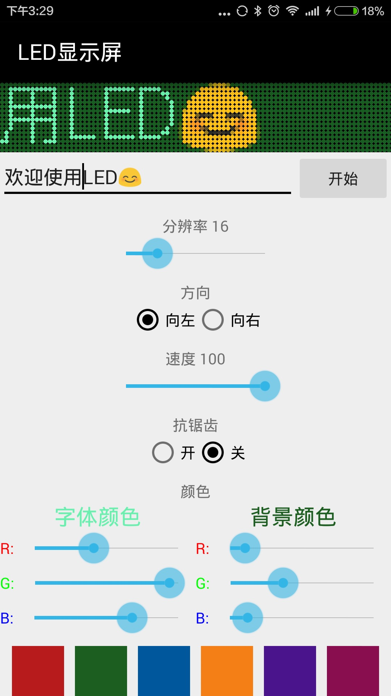

#LED 显示屏

<a class="download-btn" href="http://d.apptor.me/LEDScreen/4.5/LEDScreen-source-v4.5-build50_45_jiagu_sign.apk"><i class="fa fa-android"></i> 下载</a>

用手机屏幕模拟LED屏幕效果。

支持各种字体、图案，凡是输入法能够输入的，都能显示出来。

截图:

##4.4
1. 增加时间显示功能
2. 字幕滚动增加霓虹灯功能

##Reference

[实现原理](../articles/android/Android读取文字的像素矩阵.md)

[后记](../articles/android/LED显示屏后记.md)
