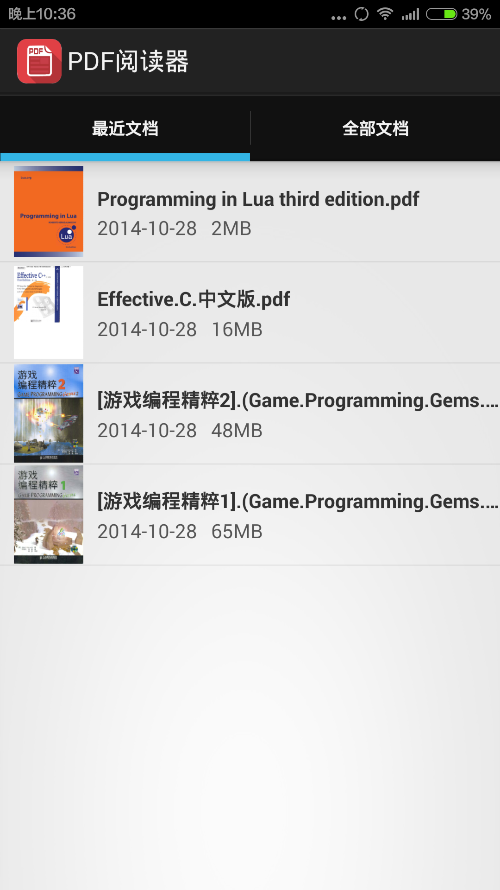
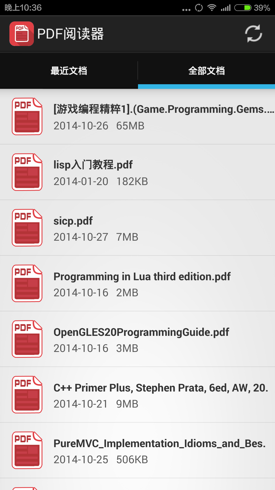
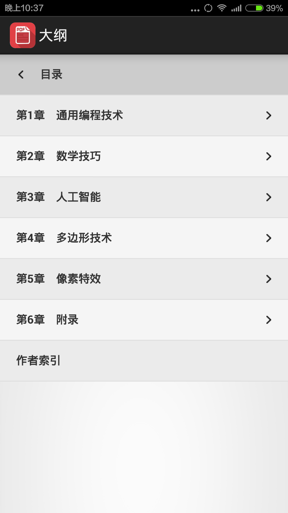

#PDF阅读器

##介绍
流畅是本PDF阅读器的一大亮点。
页面毫不花俏，专注于你的阅读，为你缔造安静的阅读气氛。这是一款非常简洁好用的PDF阅读APP，能在琳琅PDF阅读器中脱颖而出靠的不是繁琐的功能，而是阅读的根本：专注、认真。
这是一款你值得拥有的PDF阅读APP，用功能增加应用价值属于低级做法，本应用希望能用绝伦的阅读畅快体验征服你们，抛开一切繁琐的可有可无的功能，用户体验铸造一切。
本应用的具体特点如下：

1. 自动搜索手机所有PDF文档，无需手动添加。你们移动文档到手机后无需刷新，我们的PDF阅读器会即时获取你的文档，放到手机里边的PDF，你们马上可以看得见。减少一点点的麻烦，提高一大点的心情。
2. 记录最近阅读的PDF文件。快捷地找到你的需求，马上开始阅读之旅。
3. 记录PDF文件的阅读进度，看书不需“从头来”。
4. 快速阅读有办法，附带文档大纲，支持目录浏览，所有信息一目了然。
5. 错过了知识点怎么办？滑滑手指，快速找到你要翻查的知识点，所有页数随意挑，重点是还带预览。
6. 支持平板。

我们的PDF阅读器功能不在多，而在精。超级流畅好心情。超美的用户体验，谁用谁知道！

<a class="download-btn" href="http://app.mi.com/detail/78505?ref=search">下载APK</a>

###赞助者名单
名称|金额|留言|时间
----|---|----|
isilent|10元|阅读器做的不错，支持下!|2015.10.25
Vincent|10元|pdf 加油|2015.10.27
