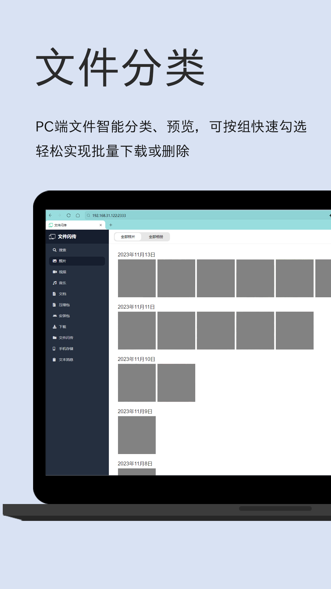
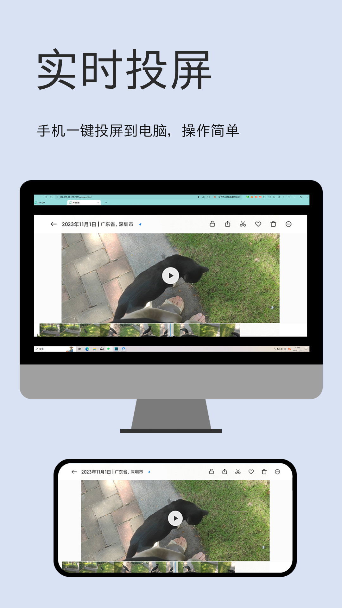
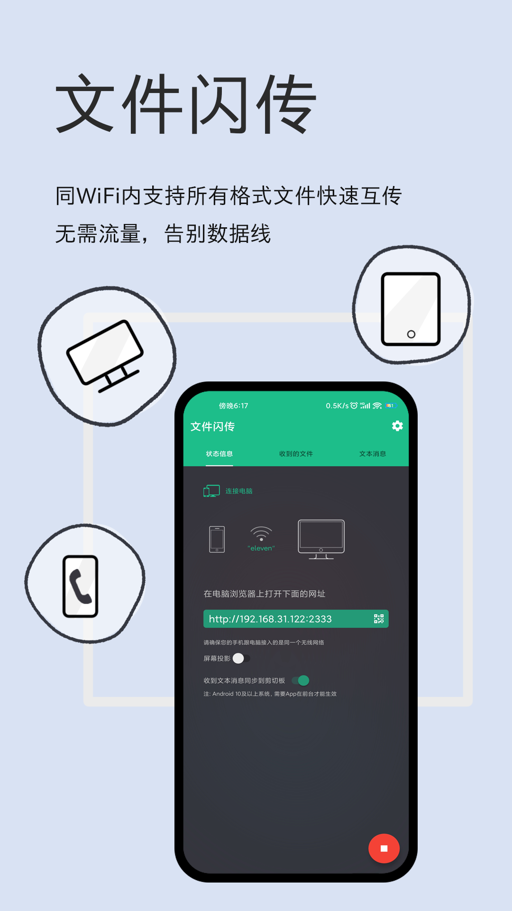

# 文件闪传

<a class="download-btn" href="http://d.apptor.me/FFT/4.1.2/FastFileTransfer-sourceRelease-4.1.2-build54.apk"><i class="fa fa-android"></i> 下载</a>

无需数据线快速传输Android手机文件到电脑上。

打开app，确保手机和电脑在连接同一个wifi，

在电脑浏览器输入app上的网址，进入网页管理。

可以分类浏览图片、音乐、视频等，还可以浏览全部文件。

可以上传文件到指定的目录。

