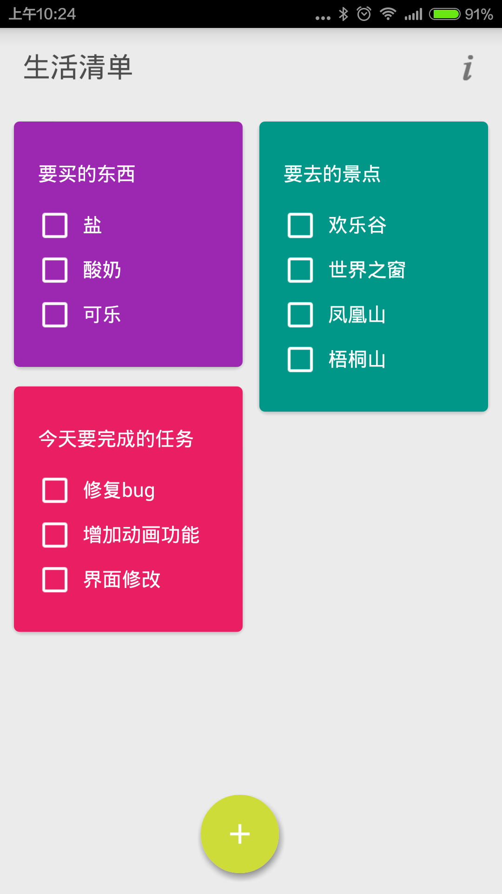
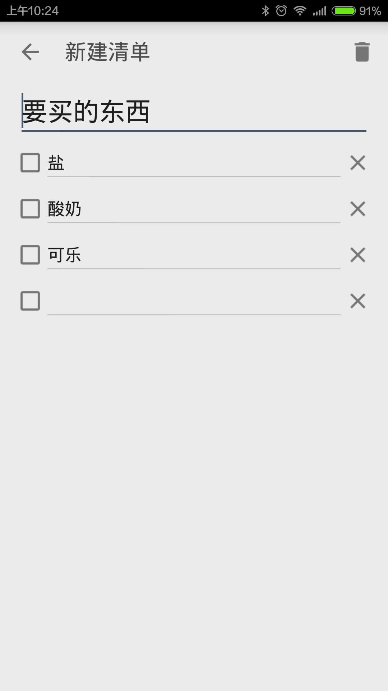
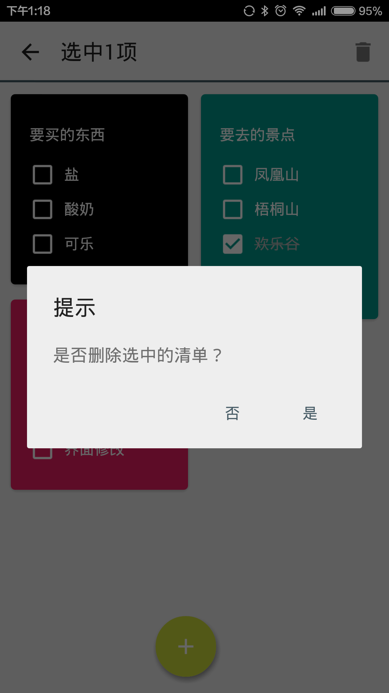

#生活清单

<a class="download-btn" href="http://app.mi.com/detail/96107?ref=search"><i class="fa fa-android"></i> 下载</a>

操作简单，让你的清单一目了然。

你在这个应用中可以做的，就是列一个又一个的列表。你可以通过勾选把已完成的事项剔除，也可以按实际情况在同一个列表中对事项进行添加或者删除。

这个APP的操作非常简单，而且不同的事项之间辨识程度高，方便你快速发现目标。

你还担心去商场买漏东西吗？你还害怕带着目的出去却把事情忘了吗？你还要忍受善忘导致的重复的麻烦吗？

只需要实使用生活清单，标题，事项，从此烦恼都没有了。

生活清单是一个很好的APP，无插件，无广告，我们致力为你们打造一个美观实用而且没有杂项烦恼的APP。

快来点我吧！

###Release Notes
####1.3
1. 修复英文第一个字母输入问题。
2. 增加颜色配置
3. 增加动画效果

###问题反馈
1. 每一个清单可以自己选择颜色
2. 首页能按时间排序
3. 回收站

#### 1.4
[x] 添加界面屏幕旋转信息丢失
[x] 主页拖动功能
[x] 列表界面拖动功能

1. 修复添加界面屏幕旋转信息丢失
2. 主页拖动功能
3. 列表界面拖动功能
操作方式更新：
原本的删除操作改为向左向右滑动删除。
长按或按住右边的handle横条可以上下移动。
